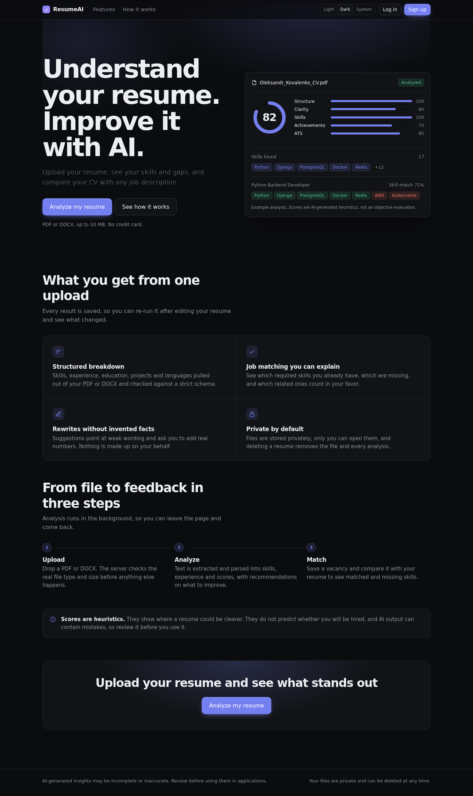
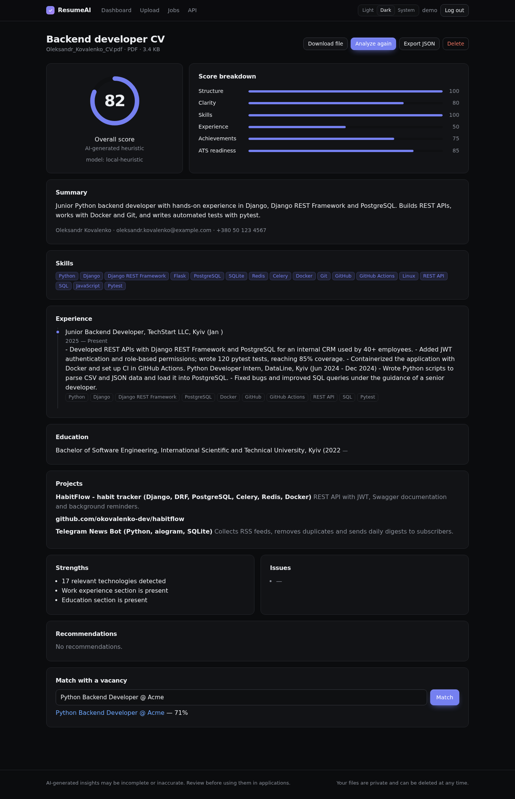

<div align="center">

# Vlad — Python Backend Portfolio

**Junior Python developer building REST APIs, Telegram bots and AI-powered web apps.**


</div>

Hi, I'm Vlad, a software engineering student from Kyiv. This repository collects my practical backend projects. Each one lives in its own folder with its own README, setup instructions and tests.

## Projects

| Project | What it is | Stack |
|---|---|---|
| [**ResumeAI**](./resumeai) | Upload a PDF/DOCX resume, get a structured AI analysis and compare it with job descriptions | Django, DRF, JWT, Pydantic, PyMuPDF, python-docx, pytest |
| [**HabitFlow**](./habitflow-v5) | Habit tracker with a REST API and background jobs | Django 5, DRF, PostgreSQL, Celery, Redis, Docker, GitHub Actions |
| [**Telegram Order Bot**](./03-telegram-order-bot-pro) | Telegram bot for handling orders | Python, Telegram Bot API |

---

## ResumeAI — AI Resume Analyzer

A Django app that turns an uploaded resume into structured, explainable feedback.

<table>
  <tr>
    <td></td>
    <td></td>
  </tr>
</table>

**What it does**

- Validates uploads on the server: real file type, size, empty and corrupted files
- Extracts text from PDF and DOCX, cleans it and sends it to an AI provider
- Checks the AI output against a Pydantic schema, with bounded retries if it is invalid
- Matches a resume against a job description and shows matched, missing and related skills
- Keeps analysis history, token usage and JSON export
- Provides a REST API with JWT and Swagger docs, plus a responsive UI with light and dark themes

**Engineering decisions worth a look**

- The AI sits behind a provider interface (`local` offline provider and `openai`), so the model can be swapped without touching business logic
- Skill matching is plain Python, not an LLM call: it is faster, cheaper and gives the same result every time
- Files are stored privately and served only to their owner; deleting a resume deletes the file and every analysis
- 15 automated tests, `ruff` linting and a GitHub Actions workflow with PostgreSQL

Scores in the app are AI-generated heuristics, not an objective evaluation, and the UI says so.

[Open the project →](./resumeai)

---

## HabitFlow — Habit Tracker API

A habit tracking backend built the way a production service would be.

- Django 5 and Django REST Framework with JWT authentication
- PostgreSQL as the database, Celery and Redis for background work
- Swagger documentation for the API
- Docker setup, pytest tests and a GitHub Actions pipeline

[Open the project →](./habitflow-v5)

---

## Telegram Order Bot

A Telegram bot for receiving and processing orders.

[Open the project →](./03-telegram-order-bot-pro)

---

## Skills

| Area | Tools |
|---|---|
| Language | Python |
| Web and APIs | Django, Django REST Framework, JWT, Swagger / OpenAPI |
| Data | PostgreSQL, SQLite, Redis |
| Background work | Celery |
| Files and AI | PDF and DOCX parsing, OpenAI API, Pydantic validation |
| Quality | pytest, ruff, GitHub Actions |
| Deployment | Docker, Docker Compose, gunicorn |
| Other | Git, Linux, Telegram Bot API |

## What I can build for you

- REST APIs for web and mobile apps
- Telegram bots with a database and an admin panel
- Tools that process documents (PDF, DOCX) and add AI features
- Dockerized projects with tests and CI

## Run any project

Every project has its own README. The usual start looks like this:

```bash
git clone https://github.com/vldxrks/portfolio.git
cd portfolio/resumeai        # or habitflow-v5, 03-telegram-order-bot-pro
pip install -r requirements.txt
```

## Contact

- GitHub: [@vldxrks](https://github.com/vldxrks)
<!-- Add your Upwork / Fiverr / email links here -->
