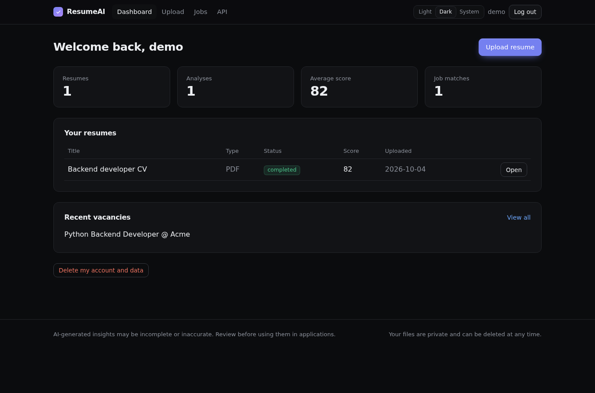
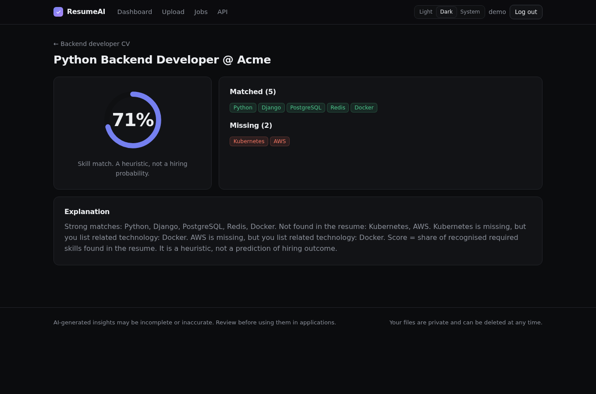

# ResumeAI — AI Resume Analyzer

Django app that takes a PDF/DOCX resume, extracts the text, analyzes it with an AI provider,
validates the output with Pydantic, and compares the resume with job descriptions.

This is the **simple version**: the core works out of the box (SQLite + offline analyzer).
No API key and no Docker are required to try it.

## Features
- Registration / login, per-user data isolation
- Upload PDF/DOCX: server-side validation (extension, size, magic bytes, empty/corrupted files), SHA-256 hash
- Private file storage (no public MEDIA_URL), files are served only to the owner and deleted with the resume
- Text extraction (PyMuPDF, python-docx) and cleaning
- AI analysis in the background (thread), real status steps, bounded retries with exponential backoff
- AI provider abstraction: `local` (offline, rule-based) and `openai`; switch with `AI_PROVIDER`
- Structured output validated by Pydantic; invalid output is retried, internals never reach the user
- Prompt injection and hallucination rules in the prompt, versioned prompt (`prompt_version` saved)
- Analysis history, token usage, JSON export
- Job vacancies and explainable matching: matched / missing / related skills, skill aliases (Postgres -> PostgreSQL)
- Rate limit (`ANALYSES_PER_HOUR`), health check, Django admin
- REST API with JWT + Swagger (`/api/docs/`), pagination, search, filtering, unified error format

Scores are AI-generated heuristics, not an objective evaluation of a candidate.

## Screenshots
| | |
|---|---|
|  |  |
|  |  |

Light and dark themes (Light / Dark / System switch in the navbar), responsive down to mobile.
Visual direction: Linear-style, hairline borders, one indigo accent.

## Quick start (no Docker)
```bash
python -m venv .venv && source .venv/bin/activate
pip install -r requirements-dev.txt
cp .env.example .env
python manage.py migrate
python manage.py createsuperuser
python manage.py runserver
```
Open http://127.0.0.1:8000, register, upload a resume.

## Docker (PostgreSQL)
```bash
cp .env.example .env
docker compose up --build
```

## Real AI
```env
AI_PROVIDER=openai
AI_API_KEY=...
AI_MODEL=...   # model name is set on the backend only
```

## Tests
```bash
pytest
ruff check .
```

## API
```bash
TOKEN=$(curl -s -X POST localhost:8000/api/v1/auth/token/ -H 'Content-Type: application/json' \
  -d '{"username":"demo","password":"..."}' | python -c 'import sys,json;print(json.load(sys.stdin)["access"])')
curl -H "Authorization: Bearer $TOKEN" -F file=@cv.pdf localhost:8000/api/v1/resumes/
curl -H "Authorization: Bearer $TOKEN" localhost:8000/api/v1/resumes/1/analysis/
curl -H "Authorization: Bearer $TOKEN" -H 'Content-Type: application/json' \
  -d '{"title":"Python Dev","description":"Python, Django, Docker"}' localhost:8000/api/v1/jobs/
curl -H "Authorization: Bearer $TOKEN" -H 'Content-Type: application/json' \
  -d '{"resume":1,"vacancy":1}' localhost:8000/api/v1/matches/create/
```

## Architecture
`views/api` -> `services` (upload, extraction, analysis pipeline) -> `ai.providers` (interface) -> Pydantic schemas -> DB.
Background execution is isolated in `services/analysis.dispatch()`; replace it with a Celery `task.delay()` to scale.

## Roadmap (not implemented yet)
Celery + Redis, PDF report, resume version comparison, notifications, interview questions.
